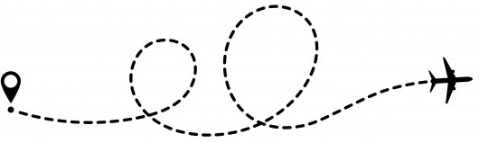

# Kim Kes - Software Developer

## Front-End   

  

  

  

## Back-End

  

  
    
  

  
  
## My Tools
        
  

  

  

 
 

## My Projects
 
### 🌱 Home Jungle | E-commerce Website
🗂️[GitHub Repo](https://github.com/kimkesdev/home_jungle)  
☮️[Live website](https://home-jungle.herokuapp.com/)  
At my former house I had a vegatable garden, I find it a beautiful process of seeing the plants grow.   
At my new house I decided to not have one again. Now I have lots of pots with herbs, fruits and flowers in the garden.   
Inside the house I have a lot different types of plants. I think I have about 20 aloë vera plants, my daughters like to make lotion of it.  
When I had to create an e-commerce website for my study I decided to do a plant shop. 

### 📁 Bucketlist | Database Project
🗂️[GitHub Repo](https://github.com/kimkesdev/bucketlist)  
☮️[Live website](https://bucketlist-2020.herokuapp.com/)  
I always have lots of ideas and always write everything down.  
I have an diary app to write every day a little bit about my life.  
Old fashion papers I use for my brainstorming.  
Every time an idea pops up, I write it down and working it out to a plan.  
I use trello to plan my studying and projects.  
When I had to create an database project, I decide to create a bucketlist website. 

### 👨‍👩‍👧‍👧 Meet my family
Playing around with CSS Flip Cards and [Avataaars](https://avataaars.com/).  
☮️[Live website](https://kimkesdev.github.io/css-projects/flip_card/flip_card.html)

### 🎨 CSS Projects
There is so much fun to create with just CSS!  
🗂️[GitHub Repo](https://github.com/kimkesdev/css-projects) 
☮️[Live website](https://kimkesdev.github.io/css-projects/)

### 📑 JavaScript Projects
JavaScript has so many cool functions! 
🗂️[GitHub Repo](https://github.com/kimkesdev/javascript-projects) 
☮️[Live website](https://kimkesdev.github.io/javascript-projects/)

  
## Hackathons

### #herhackathon 💁‍♀️
24-27 Juni 2021  
#herhackathon

### #proud-coders Hackathon 🏳️‍🌈
16-21 June 2021  
#proud-coders Hackathon.  
Theme: community  
Code Institute's first ever LGBTQ+ Hackathon!  
🗂️[GitHub Repo](https://github.com/RussOakham/Pride-In-Coding) 
☮️[Live website](https://pride-in-coding.herokuapp.com/)  
We divided all tasks and took track of them throught the GitHub Projects page. I took the About Us Page and the README.

### #women-in-tech Hackathon 
5-10 May 2021  
Code Institute's first-ever #women-in-tech Hackathon.  
Theme: Let's inspire, connect and grow Code Institute's Women in Tech community!  
🗂️[GitHub Repo](https://github.com/thanh-cao/hackathon-command-girl) 
☮️[Live website](https://thanh-cao.github.io/hackathon-command-girl/)  
My team had five developers. Three Code Institute students and two former students (me). It was the first hackathon for all of us.  
We learned how to brainstorm through Slack calls, collaborate and divide tasks.  
The three students only learned about HTML and CSS, so they did the styling part. I set up a Bootstrap theme with the starting webpages.  
The other former student rebuild our project in Python and integrated a MongoDB database, but the others couldn't work with it, so it was build back to the basics.  
I love typing and thinking, so I was writing the whole README and build the contact form. I was not happy with the form, so after the hackathon I build multiple forms to get the hang of it.  
We didn't win, but that was never the intention. We were proud of the work we produced in the short time we had.  
And it was a great experience to work together with other developers and see how others work and think. 

  
## This is me
  
### 🎇
During the day I'm focused, creating, investigating, planning, reading, studying.  
When it's dark I need a notebook, because one idea pops up after another idea.  
At night I dream solutions.  
And in the morning I run. Some days hard, some days relaxt. Some days far, some days just a bit.

### 🏃
I run with my friend, chatting away. Like tea time, but more active.  
I run with my mom at our atletics club, learning running techniques.  
And I run with my husband. My husband only knows one speed, and that's full speed. His biggest passion is speed surfing. It's all about fast, faster, fastest. 
He doesn't run underneath 10km and doesn't do 'fast walking'. So, no chatting, just full speed.  
Well, it makes me push myself, and I like it (afterwards). 
 
### 🌕
Every full moon I go for a walk with my friend. We just enjoy the nature and chat about life.   
We also do all sorts of activities outside of our comfort zone.   
Like ecstatic dance. Don't connect with your surrounding, only connect with yourself.  
Silence day at a community. 8 hours of yoga, meditation, walk in nature, eating without talking or eye contact. Only to learn to listen to ourselfs.  
I found out I'm affraid of cold circumstances, when I had to walk bare foot in the snow. Since then I do it every winter.  
Also I started swimming outdoors on cold days. The coldest water temperature I swom in was 7 degrees celcius. Brrr.  
If we fear something, we'll do it.

 

